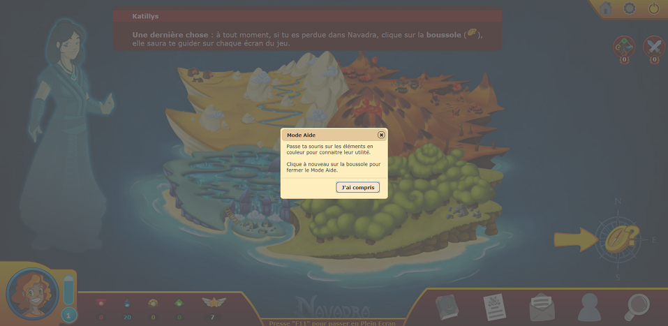

# Créer un utilisateur

## Créer un compte professeur (admin)

Cliquer sur le bouton "S'inscrire" sur la page d'accueil.

**Une fois sur la page d'inscription :**
> - Choisissez "Prof" en tant que classe
> - Rentrez **bissectrice** dans le champ "Code Prof" qui vient d'apparaître
> - Remplissez les champs restants et choisissez votre avatar

**ATTENTION** : ce mot de passe doit être communiqué avec prudence. En effet les comptes Prof ont beaucoup de privilèges dont la possibilité de supprimer des comptes utilisateurs.

Une fois l'inscription termineé, vous débutez le tutoriel. **Vous devez nécessairement finir le tutoriel** afin de pouvoir accéder aux fonctionnalités professeurs.
Vous saurez que le tutoriel est fini lorsque l'on vous invitera à cliquer sur la boussole et que la bulle d'aide suivante s'affichera :
 

## Créer un compte élève

Cliquer sur le bouton "S'inscrire" sur la page d'accueil.

**Une fois sur la page d'inscription :**
> - Choisissez 6°, 5°, 4° ou 3° en tant que classe
> - Si vous souhaitez que l'élève soit rattaché à une classe cliquez sur "J'ai le code de ma classe" et rentrez les 4 caractères de votre code (ex: "OXRT")
> - Remplissez les champs restants et choisissez votre avatar