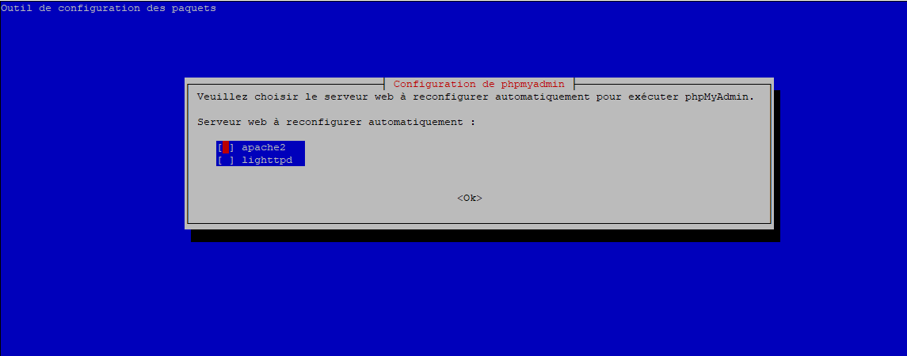
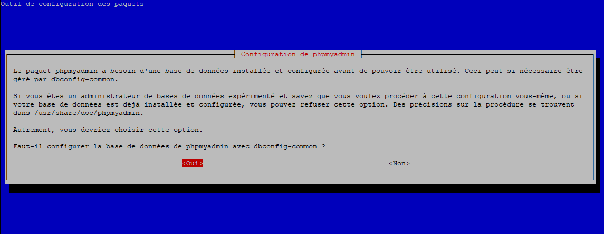
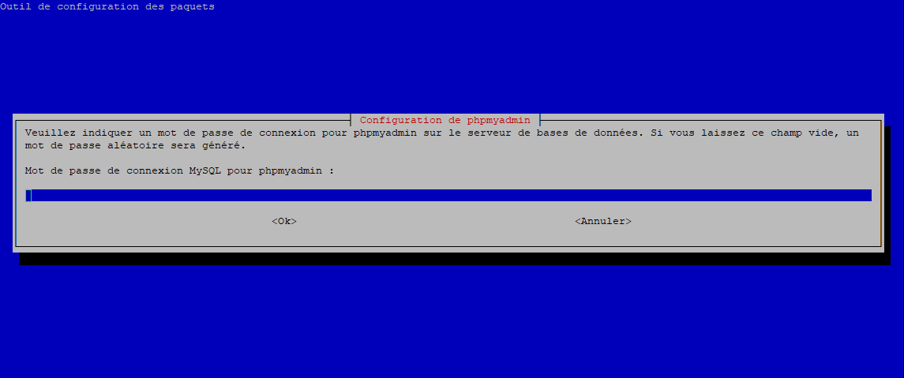

# Installation pour Linux Debian

Si vous souhaitez installer sur une autre distribution :
- certaines commandes peuvent changer
- certaines librairies peuvent avoir un nom légèrement différent

L'exemple ici se base sur une Debian 9 en installation minimale avec juste un serveur SSH (pas interface graphique mais rien ne vous empèche d'en avoir une).

Une fois installé connectez vous en ssh passez en root et suivez les instructions.

##### Mise à jour du système

Ajout des dépots pour PHP
```console
apt install -y ca-certificates apt-transport-https 
wget -q https://packages.sury.org/php/apt.gpg -O- | sudo apt-key add -
echo "deb https://packages.sury.org/php/ stretch main" | sudo tee /etc/apt/sources.list.d/php.list
```

Mise à jour de la distribution
```console
apt-get -y update
apt-get -y upgrade
```

##### Librairies supplémentaires

```console
apt -y install git git-core nmap ntp openssl sudo unzip zip gcc make autoconf libc-dev pkg-config 
```

##### Les coimposants essentiels

NGINX
```console
apt -y install nginx
```

MYSQL

```console
apt -y install mysql-server mysql-client
```

PHP
```console
apt -y install php7.2 php7.2-mysql php7.2-fpm php7.2-gd php7.2-cli
```

PHPMYADMIN
```console
apt -y install phpmyadmin
```

Lors de l'écran suivant :<br>
<br>
Ne sélectionnez rien et cliquez sur ok

Choisissez oui pour db-config
<br>

Choisissez un mot de passe complexe et notez le quelque part :)
<br>
et confirmez-le en le ressaisissant.

Install quelques librairies supplémentaires
```console
apt -y install php-swiftmailer libphp-swiftmailer
apt -y install curl libcurl3 php7.2-curl
```

###### Configuration supplémentaire phpmyadmin

```console
sed -i "s/^;cgi.fix_pathinfo=1/cgi.fix_pathinfo=0/" /etc/php/7.2/fpm/php.ini
sed -i "s/^max_execution_time = 30/max_execution_time = 300/" /etc/php/7.2/fpm/php.ini
sed -i "s/^;listen.owner = www-data/listen.owner = www-data/" /etc/php/7.2/fpm/pool.d/www.conf
sed -i "s/^;listen.group = www-data/listen.group = www-data/" /etc/php/7.2/fpm/pool.d/www.conf
sed -i "s/^;listen.mode = 0660/listen.mode = 0660/" /etc/php/7.2/fpm/pool.d/www.conf
ln -s /usr/share/phpmyadmin /var/www/html/phpmyadmin
```

###### Installation de mcrypt
```console
apt -y install php7.2-dev libmcrypt-dev
pecl install mcrypt-1.0.1
```

A la question : 
```console
libmcrypt prefix? [autodetect] :
```
Validez 

Puis on termine la config :
```console
echo "extension=mcrypt.so" >> /etc/php/7.2/fpm/php.ini
echo extension=/usr/lib/php/20170718/mcrypt.so > /etc/php/7.2/cli/conf.d/mcrypt.ini
```


##### Configuration NGINX
mv /var/www/html/index.nginx-debian.html /var/www/html/index.html


Dans le fichier /etc/nginx/sites-available/default
remplacez la ligne : 
```console
index index.html index.htm index.nginx-debian.html;
```
par :
```console
index index.html index.htm index.php;
```

Et juste en dessous du bloc : 
```console
location / {
    # First attempt to serve request as file, then
    # as directory, then fall back to displaying a 404.
    try_files $uri $uri/ =404;
}
```
ajoutez les lignes suivantes : 
```console
location ~ \.php$ {
    include snippets/fastcgi-php.conf;
    fastcgi_pass unix:/var/run/php/php7.2-fpm.sock;
    disable_symlinks off;
  }
location ~*  \.(jpg|jpeg|png|gif|ico|mp3|ogg)$ {
    log_not_found off;
    access_log off;
}
```

On sauvegarde le fichier de configuration initial :
```console
mv /etc/nginx/nginx.conf /etc/nginx/nginx.conf.bak
```

Et vous pouvez copier coller tout le bloc suivant pour créer un fichier de conf pour Navadra :
```console
cat > /etc/nginx/nginx.conf << 'EOF'

user www-data;
worker_processes 4;
pid /run/nginx.pid;

events {
  worker_connections 768;
  multi_accept on;
}

http {

  ##
  # Basic Settings
  ##

  sendfile on;
  tcp_nopush on;
  tcp_nodelay on;

  client_body_timeout 8;
  client_header_timeout 8;
  client_max_body_size 32M;
  send_timeout 6;

  keepalive_timeout 10;
  types_hash_max_size 2048;

  include /etc/nginx/mime.types;
  default_type application/octet-stream;

  ##
  # SSL Settings
  ##

  ssl_protocols TLSv1 TLSv1.1 TLSv1.2; # Dropping SSLv3, ref: POODLE
  ssl_prefer_server_ciphers on;

  ##
  # Logging Settings
  ##

  access_log /var/log/nginx/access.log;
  error_log /var/log/nginx/error.log;

  ##
  # Gzip Settings
  ##

  gzip on;
  gzip_disable "msie6";

  # gzip_vary on;
  # gzip_proxied any;
  # gzip_comp_level 6;
  # gzip_buffers 16 8k;
  # gzip_http_version 1.1;
  # gzip_types text/plain text/css application/json application/javascript text/xml application/xml application/xml+rss text/javascript;

  ##
  # Virtual Host Configs
  ##

  include /etc/nginx/conf.d/*.conf;
  include /etc/nginx/sites-enabled/*;
}
EOF
```

Pour optimiser nginx de nombreux tutoriels sont disponibles sur le net.

```console
chown -R www-data:www-data /usr/share/phpmyadmin
chmod -R 755 /usr/share/phpmyadmin
chown -R www-data:www-data /var/www/html
chmod -R 755 /var/www/html

service php7.2-fpm restart
service nginx restart
```

On vérifie que tout fonctionne correctement en créant une page php : 
```console
cat > /var/www/html/info.php << 'EOF'
<?php phpinfo(); ?>
EOF
```
et dans un navigateur allez maintenant sur l'adresse ip de votre serveur (dans mon cas : 192.168.1.8)
http://192.168.1.8/info.php

Une page d'information surphp devrait s'afficher, signifiant que php fonctionne correctement.

on retire cette page par prudence :
```console
mv /var/www/html/info.php /var/www/html/info.ph_
```

#### Récupération du projet Navadra
Allons dans le répertoire www du serveur web :
```console
cd /var/www/
```
Récupérez la dernière version de Navadra le jeu :
```console
wget -c https://github.com/Navadra/navadra-jeu/archive/master.zip
unzip master.zip
```

On supprime le répertoire html existant et on fait un lien symbolique:
```console
cd /var/www/
rm -R html
ln -s navadra-jeu-master/ html
```

on recréé l'accès à phpmyadmin
cd /var/www/html/
ln -s /usr/share/phpmyadmin phpmyadmin

Une fois de plus nous allons remettre les droits correctement :
```console
chown -R www-data:www-data /var/www/html
chmod -R 755 /var/www/html
service php7.2-fpm restart
service nginx restart
```

#### Configuration de mysql
Lancez :
```console
mysql_secure_installation
```
et suivez les instructions.
1- Définissez mot de passe root complexe **important**
2- Remove anonymous users? **Y**
3- Disallow root login remotely? **Y**
4- Remove test database and access to it? **Y**
5- Reload privilege tables now? **Y**

Maintenant on va créer la base de données :
```console
mysql -u root -p
```

Il vous demande un mot de passe c'est celui que vous venez de créer.

Création de la base de donnée Navadra
CREATE DATABASE navadra;

Création de l'utilisateur qui aura accès à la base Navadra (pour ne pas configurer le compte root sur le jeu) :
```console
DROP USER 'navadra'@'localhost';
CREATE USER 'navadra'@'localhost' IDENTIFIED BY 'Inventez un mot de passe';
CREATE USER 'navadra'@'127.0.0.1' IDENTIFIED BY 'Le meme mot de passe que celui que vous venez d'inventer';
GRANT ALTER, CREATE, CREATE TEMPORARY TABLES, DELETE, DROP, INSERT, LOCK TABLES, SELECT, UPDATE ON navadra.* TO 'navadra'@'localhost';
FLUSH PRIVILEGES;
```

**Notez bien le mot de passe MySQL de l'utilisateur Navadra que vous venez de créer**

ctrl+d pour sortir de la console mysql ou 'exit'

Initialisation de la base de données :
```console
mysql -u navadra -p navadra < /var/www/html/DB/NAVADRA_INIT.sql
```

Et on relance le serveur MySQL:
```console
service mysql restart
```


#### Configuration de l'application Navadra
Changez le mot de passe d'accès à la base de données pour l'utilisateur Navadra en éditant les fichiers de configuration suivants :
```console
vi /var/www/html/app/controllers/include_path.php
vi /var/www/html/app/controllers/include_path_sans_autoload.php
```

vous avez simplement à remplacer les **'MOT_DE_PASSE_A_CHANGER'** par le mot de passe MySQL de l'utilisateur Navadra que vous venez de créer.

Si erreur :
```console
tail -f /var/log/nginx/error.log
```

#### Le par-feu

Si vous souhaitez controler un peu mieux les accès à votre serveur exécutez les lignes suivantes :


```console
iptables -P INPUT ACCEPT
iptables -F
iptables -A INPUT -i lo -j ACCEPT
iptables -A INPUT -m state --state ESTABLISHED,RELATED -j ACCEPT
iptables -P INPUT DROP
iptables -P FORWARD DROP
iptables -P OUTPUT ACCEPT
iptables -A INPUT -i eth0 -p icmp -j ACCEPT
iptables -A INPUT -p tcp --dport 22 -j ACCEPT
iptables -A INPUT -p tcp --dport 80 -j ACCEPT
iptables -A INPUT -p tcp --dport 443 -j ACCEPT
iptables -A INPUT -p tcp --dport 3306 -s 127.0.0.1 -j ACCEPT

apt -y install iptables-persistent
```
et répondez par 'oui' aux questions.
 


