# Installation pour Windows

#### Téléchargez WAMP 
<a href="https://sourceforge.net/projects/wampserver/files/latest/download" target="_blank">Page de téléchargement de WAMP</a>

Et l'installer sur votre serveur.

**ATTENTION :**
> - N'installez pas Wampserver PAR-DESSUS une version existante
> - Installez Wampserver dans un dossier à la racine d'un disque
> - Fermer Skype ou ne pas laisser ouvert le port 80
> - Désactiver Microsoft IIS s'il est activé

Répertoire d'installation conseillé :<br>
**c:\wamp64**

Voici l'enchainement des étapes :<br>

##### Choisissez la langue
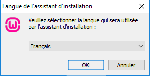<br>
##### Acceptez la license
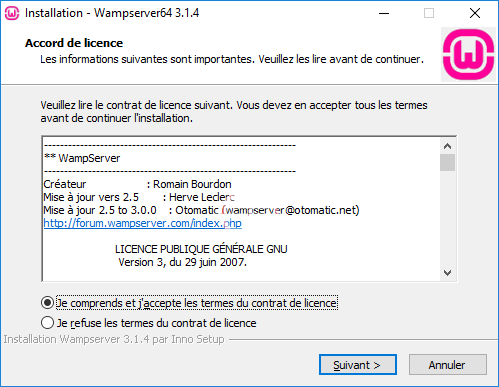<br>
##### Informations générales
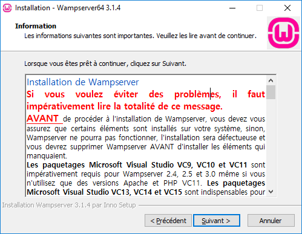<br>
##### Répertoire d'installation conseillé : **c:\wamp64**
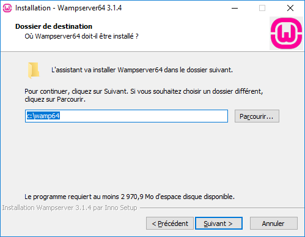<br>
##### Suivant
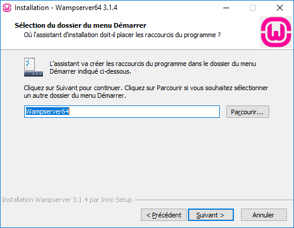<br>
##### Installer
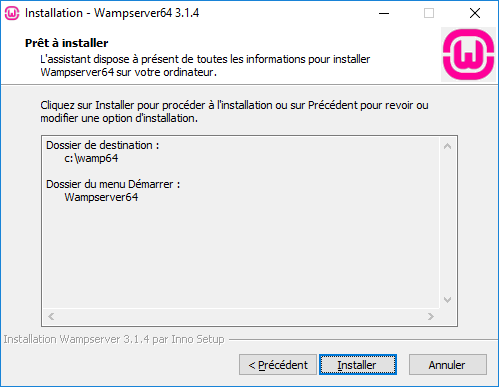<br>
##### Installation en cours
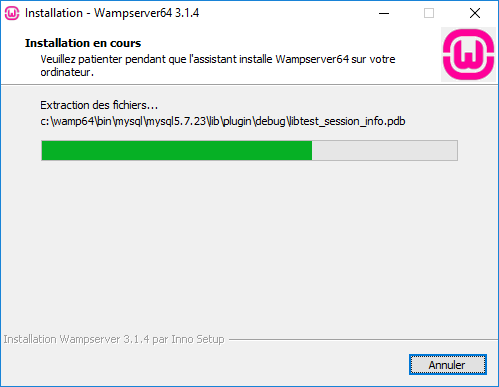<br>
##### Préférez-vous utiliser un autre navigateur qu'Internet Explorer ?
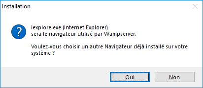<br>
##### Préférez-vous utiliser un autre éditeur de texte que Notepad ?
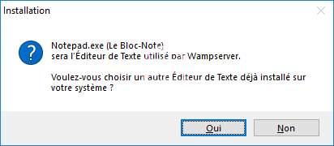<br>
##### La configuration du pare-feu permet à votre serveur d'être visible pour les utilisateurs
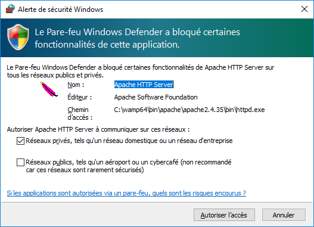<br>
##### Lisez attentivement les indications suivantes
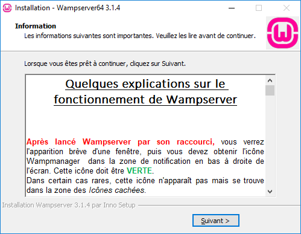<br>


#### Récupérez Navadra le jeu

Téléchargez le ou clonez le repository :<br>
<a href="https://github.com/Navadra/navadra-jeu/archive/master.zip" target="_blank">ZIP de la dernière version</a>

puis extrayez l'archive directement dans le répertoire **C:\wamp64\www** sans aucun sous-répertoire.

#### Execution

Lancer wamp 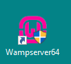<br>


#### Créez la base de données
Allez sur : <a href="http://localhost/phpmyadmin/" target="_blank">http://localhost/phpmyadmin/</a><br>
Utilisateur  : root<br>
Mot de passe : 

Cliquez sur "Nouvelle base de données"<br>
Nom : navadra (en minuscule !!)<br>
utf8_general_ci

Cliquez sur "créer"<br>
Puis importez le fichier **C:\wamp64\www\DB\NAVADRA_INIT.sql**

#### Créez un utilisateur navadra dans la DB
Toujours dans phpmyadmin <a href="http://localhost/phpmyadmin/" target="_blank">http://localhost/phpmyadmin/</a> créez un utilisateur **navadra** à qui vous donnerez les droits :<br>
**ALTER, CREATE, CREATE TEMPORARY TABLES, DELETE, DROP, INSERT, LOCK TABLES, SELECT, UPDATE**<br>
sur la base de données navadra que vous venez de créer.

Notez bien le mot de passe MySQL de l'utilisateur Navadra que vous venez de créer.


#### Configuration de l'application Navadra
Changez le mot de passe d'accès à la base de données pour l'utilisateur Navadra en éditant les fichiers de configuration suivants :
```console
C:\wamp64\www\app\controllers\include_path.php
C:\wamp64\www\app\controllers\include_path_sans_autoload.php
```

vous avez simplement à remplacer les **'VOTRE_MOT_DE_PASSE'** par le mot de passe MySQL de l'utilisateur Navadra que vous venez de créer.

#### Tester le jeu

Rendez-vous sur <a href="http://localhost/" target="_blank">http://localhost/</a> et le jeu devrait se lancer.

Ensuite vérifiez que le jeu est accessible via l'adresse IP de votre serveur windows (vérifiez que les pare-feu laisse passer le traffic sur le port 80)

**Félicitations** :smiley:
